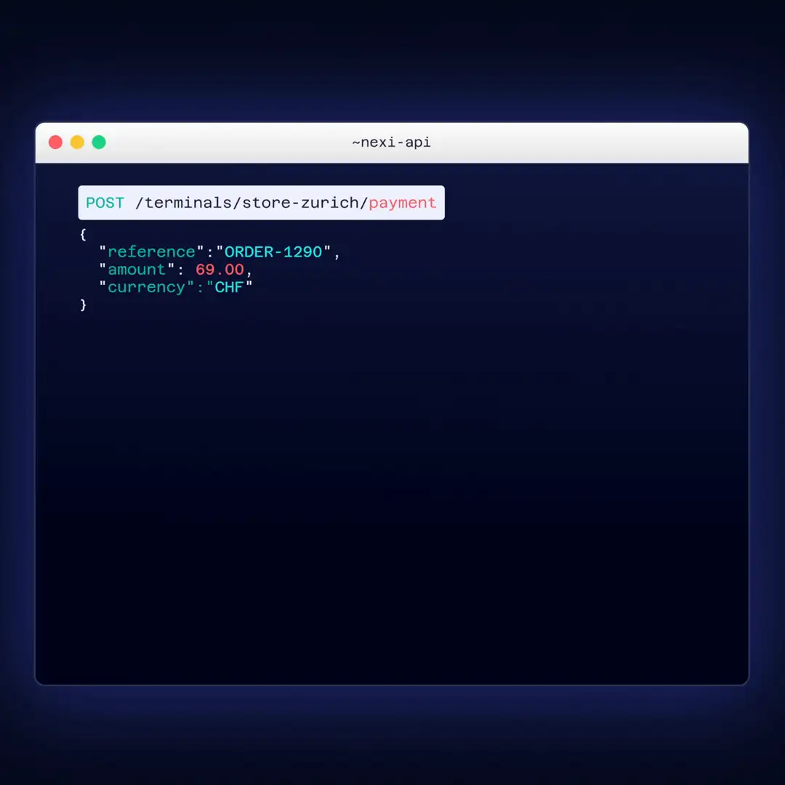

# Nexi OPI Proxy

Nexi OPI Proxy gives integrators a cleaner way to work with Nexi payment terminals in Switzerland.

Instead of dealing with OPI XML, TCP sockets, receipt routing, and device messaging directly, you run one Docker service and talk to a small local HTTP and JSON API.



When this bundle is published into the public distribution repo, the repository root represents this release snapshot and older versions are tracked through Git tags and GitHub Releases.

## Why It Exists

- simpler local integration for POS, middleware, kiosk, and demo setups
- Docker-first installation and upgrades
- transaction and receipt storage outside the container
- bearer-token authentication with scoped access
- TLS-ready runtime model for non-local deployments

## Official Terminal Scope

The public release line officially supports:

- Ingenico RX5000
- Ingenico DX8000
- Ingenico EX8000
- PAX Q30
- PAX A77
- PAX IM15
- PAX IM30

That is the supported public scope for this release line. Other terminal models may exist in internal development, but they are not part of the official support statement.

## Supported Brands

<p>
  
  
  
  
  
  
  
  
</p>

These icons show the payment brands officially tested through the OPI Proxy as of today.

Other brands relevant to the Swiss market can still work through the underlying OPI integration. The current limitation is narrower request-level brand filtering through `paymentMethods`, not general terminal-side OPI processing.

Brand filtering in the API controls which brands can be processed for a request when explicitly requested. It does not change what the terminal UI shows. The terminal display remains driven by terminal configuration.

## Quick Start

1. Copy `.env.example` to `.env`.
2. Copy `config/terminal-profiles.json.example` to `config/terminal-profiles.json`.
3. Copy `config/terminals.json.example` to `config/terminals.json`.
4. Review `config/terminal-models.json`, `config/terminal-profiles.json`, and `config/terminals.json`.
5. Choose how to get the image:
   `docker compose pull` to fetch `ghcr.io/richiehug/nexi-opi-proxy:1.1.0` from GHCR without a GitHub login
   or `docker load -i image/nexi-opi-proxy-1.1.0-linux-arm64.tar` on Raspberry Pi if the matching public release asset was provided separately
6. Run `docker compose run --rm auth-init`.
7. Start the proxy with `docker compose up -d`.
8. Check `docker compose logs -f proxy`.

The shipped `.env.example` is set up for an easy Docker-first start with `STORAGE=db`, `RESPONSE_MODE=async`, `TLS_MODE=disabled`, and `ALLOW_INSECURE_REMOTE_HTTP=true`. That means:

- localhost and other explicitly published HTTP binds can start without a certificate
- if you want legacy blocking responses, set `RESPONSE_MODE=sync`
- if you want TLS, switch to `TLS_MODE=auto` or `TLS_MODE=required` and provide certificates

Mutating API routes support the `Idempotency-Key` header. Reusing the same key with the same request content returns the same proxy response again, which is useful for safe client retries.

Local health check:

```bash
curl http://127.0.0.1:3001/health
```

If you switch to HTTPS, use `https://` and trust or ignore the development certificate as needed.

## Repository Layout

- `.env.example`: runtime environment template
- `.gitignore`: protects runtime-owned local files from being tracked accidentally
- `docker-compose.yml`: Docker entrypoint for the proxy and setup tools
- `config/terminal-models.json`: Nexi-owned terminal model catalog for this release
- `config/terminal-profiles.json.example`: merchant or integrator profile examples
- `config/terminals.json.example`: merchant or integrator terminal examples
- `config/terminal-profiles.json`: your local working profile file after setup
- `config/terminals.json`: your local working terminal file after setup
- `config/auth.json`: generated during `auth-init`
- `data/`: persisted transaction and receipt data
- `logs/`: application logs and optional OPI traces
- `image/`: optional offline Docker archive location when downloaded from a public release asset
- `docs/`: setup, configuration, API, storage, and upgrade guidance
- `openapi.yaml`: OpenAPI description of the public HTTP API

## API At A Glance

All routes except `/health` require a bearer token. See [API Overview](docs/04-api.md) for behavior and examples, and [`openapi.yaml`](openapi.yaml) for complete request and response schemas.

### Health

| Route | Purpose |
| --- | --- |
| `GET /health` | Confirms that the proxy is running and returns its version. |

### Payments And Financial Operations

| Route | Purpose |
| --- | --- |
| `POST /terminals/:terminalAlias/payment` | Starts a sale or pre-authorisation. |
| `POST /terminals/:terminalAlias/refund` | Starts a standalone terminal refund. |
| `POST /terminals/:terminalAlias/reversal` | Reverses the terminal's last payment. |
| `POST /transactions/:transactionId/capture` | Captures a stored pre-authorisation. |
| `POST /transactions/:transactionId/cancel` | Cancels a stored pre-authorisation. |
| `POST /transactions/:transactionId/refund` | Refunds a specific stored transaction. |

### Receipts

| Route | Purpose |
| --- | --- |
| `GET /transactions/:transactionId/receipts` | Returns receipts linked to one transaction. |
| `GET /terminals/:terminalAlias/receipts/latest` | Returns the latest transaction or service receipt bundle for a terminal. |
| `GET /terminals/:terminalAlias/receipts?limit=5` | Lists recent receipt bundles for a terminal. |
| `POST /terminals/:terminalAlias/reprint` | Requests the terminal's last receipt again, including for `PrintLastTicket` recovery. |

### Terminal Management

| Route | Purpose |
| --- | --- |
| `GET /terminals/:terminalAlias/info` | Reads terminal identity, software, acquirer, and card-circuit information. |
| `GET /terminals/:terminalAlias/status` | Reads live OPI status and cached proxy state. |
| `GET /terminals/:terminalAlias/ping` | Checks network reachability without opening an OPI session. |
| `POST /terminals/:terminalAlias/activate` | Opens the terminal session. |
| `POST /terminals/:terminalAlias/deactivate` | Closes the terminal session. |
| `POST /terminals/:terminalAlias/abort` | Cancels the currently pending card flow. |
| `POST /terminals/:terminalAlias/transmit` | Submits terminal-side transactions. |
| `POST /terminals/:terminalAlias/close` | Performs final balance and logoff. |
| `POST /terminals/:terminalAlias/config` | Refreshes terminal configuration through TMS. |
| `POST /terminals/:terminalAlias/init` | Refreshes merchant/acquirer initialisation. |
| `POST /terminals/:terminalAlias/reset` | Restarts the terminal application. |

### Transactions

| Route | Purpose |
| --- | --- |
| `GET /transactions/:transactionId` | Returns the persisted transaction and its current status. |
| `PATCH /transactions/:transactionId` | Manually reconciles proxy state after external verification; admin only. |

Receipts are linked to their transaction or terminal service operation, so later operations do not overwrite earlier receipt bundles.

## Documentation

Read the numbered pages in order for a first installation:

1. [Installation](docs/01-installation.md)
2. [Configuration](docs/02-configuration.md)
3. [Authentication](docs/03-authentication.md)
4. [API Overview](docs/04-api.md)
5. [Storage and Receipts](docs/05-storage-and-receipts.md)
6. [Security and TLS](docs/06-security-tls.md)
7. [Upgrading](docs/07-upgrading.md)
8. [Release Notes](docs/08-release-notes.md)
